# InsureBook User Guide

**InsureBook** is a **desktop application** built to help insurance agents **manage and organize their client information more effectively**. Its primary purpose is to streamline the day-to-day workflow of agents, allowing them to **store, access, update and keep track of client data with ease**.

By combining the speed of a **Command Line Interface (CLI)** with the familiarity of a **Graphical User Interface (GUI)**, InsureBook is optimized for fast, efficient use. If you're a quick typist, you'll find that InsureBook lets you **perform contact management tasks faster than traditional point-and-click apps** — all while maintaining clarity and control over your client base.

As a result, with InsureBook, we're not just insuring policies—we're insuring smiles!

## How to Use This Guide

This User Guide is designed to help you get the most out of InsureBook. Here's how to navigate it effectively:

1. **[Quick Start](#quick-start)** (For New Users)
   * If you're new to InsureBook, start with the Quick Start section
   * This section provides step-by-step instructions to get you up and running quickly

2. **[Commands](#commands)** (For All Users)
   * The Commands section contains detailed information about all available commands
   * Commands are organized into categories:
     * Client Management ([add](#adding-a-person-add), [edit](#editing-a-person-edit), [delete](#deleting-a-person-delete))
     * Policy Management ([renew](#updating-a-policy-renewal-date-renew), [viewrenewals](#viewing-upcoming-policy-renewals-viewrenewals), [filter](#view-policy-renewals-in-the-specified-date-range-filter))
     * Search and List ([find](#locating-persons-by-keyword-find), [list](#listing-all-persons-list))
     * General Commands ([help](#viewing-help-help), [clear](#clearing-all-entries-clear), [exit](#exiting-the-program-exit))

3. **[Command Summary](#command-summary)** (For Quick Reference)
   * The Command Summary section provides a quick overview of all commands
   * Use this section as a quick reference when you're familiar with the commands

4. **Additional Resources**
   * [FAQ](#faq): Answers to common questions
   * [Known Issues](#known-issues): Solutions to common issues

 
---

## Understanding Callout Boxes

Throughout this guide, you'll encounter different types of callout boxes that provide important information:

<box type="info" seamless>

**Note Box** 📝

Provides additional information or clarifications about a feature or command. Look for these when you need more details about how something works.
</box>

<box type="tip" seamless>

**Tip Box** 💡

Offers helpful tips and best practices. These can help you use InsureBook more effectively.
</box>

<box type="warning" seamless>

**Warning Box** ⚠️

Highlights important warnings or potential issues. Pay special attention to these to avoid problems.
</box>

<box type="danger" seamless>

**Danger Box** ⛔

Indicates critical warnings or irreversible actions. Always read these carefully before proceeding.
</box>
 
---  

## Table of Contents

1. [How to Use This Guide](#how-to-use-this-guide)
2. [Understanding Callout Boxes](#understanding-callout-boxes)
3. [Quick Start](#quick-start)
4. [Commands](#commands)
   * [Client Management Commands](#client-management-commands)
     * [Adding a person](#adding-a-person-add)
     * [Editing a person](#editing-a-person-edit)
     * [Deleting a person](#deleting-a-person-delete)
   * [Policy Management Commands](#policy-management-commands)
     * [Updating a policy renewal date](#updating-a-policy-renewal-date-renew)
     * [Viewing upcoming policy renewals](#viewing-upcoming-policy-renewals-viewrenewals)
     * [View policy renewals in date range](#view-policy-renewals-in-the-specified-date-range-filter)
   * [Search Commands](#search-commands)
     * [Listing all persons](#listing-all-persons-list)
     * [Locating persons by keyword](#locating-persons-by-keyword-find)
   * [General Commands](#general-commands)
     * [Viewing help](#viewing-help-help)
     * [Clearing all entries](#clearing-all-entries-clear)
     * [Saving the data](#saving-the-data)
     * [Editing the data file](#editing-the-data-file)
     * [Exiting the program](#exiting-the-program-exit)
5. [FAQ](#faq)
6. [Known Issues](#known-issues)
7. [Command Summary](#command-summary)

<!-- * Table of Contents -->
<page-nav-print />

---

## Quick start

1. Ensure you have Java `17` or above installed in your Computer. 
   **Mac users:** Ensure you have the precise JDK version prescribed [here](https://se-education.org/guides/tutorials/javaInstallationMac.html).

1. Download the latest `.jar` file from [here](https://github.com/AY2425S2-CS2103-F08-2/tp/releases).

1. Copy the file to the folder you want to use as the _home folder_ for your InsureBook.

1. Open a command terminal, `cd` into the folder you put the jar file in, and use the `java -jar InsureBook.jar` command to run the application. 
   A GUI similar to the below should appear in a few seconds. Note how the app contains some sample data. 
   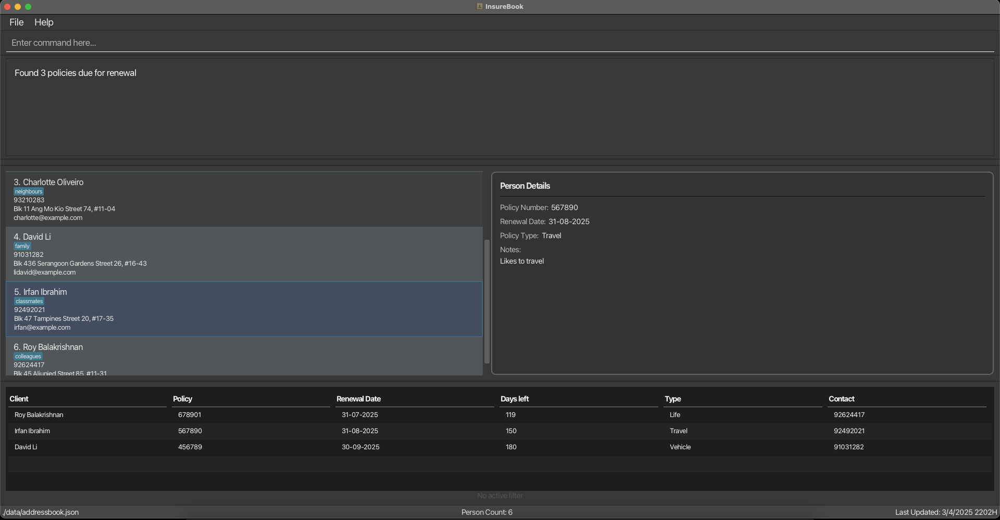

1. Type the command in the command box and press Enter to execute it. e.g. typing **`help`** and pressing Enter will open the help window. 
   Some example commands you can try:

    * `list` : Lists all contacts.

    * `add n/John Doe p/98765432 e/johnd@example.com a/John street, block 123, #01-01 pol/123456` : Adds a contact named `John Doe` to the Address Book.

    * `delete 3` : Deletes the 3rd contact shown in the current list.

    * `clear` : Deletes all contacts.

    * `exit` : Exits the app.

<box type="warning" seamless>

**Warning: Data Corruption**

If the data file is corrupted:
* InsureBook will start with an empty address book
* Your previous data will not be loaded
</box>

Refer to the [Commands](#commands) below for details of each command.

---

## Commands

InsureBook provides you with several types of commands to manage your client information effectively:

### [Client Management Commands](#client-management-commands)
* [Adding a person](#adding-a-person-add) - `add`
* [Editing a person](#editing-a-person-edit) - `edit`
* [Deleting a person](#deleting-a-person-delete) - `delete`

### [Policy Management Commands](#policy-management-commands)
* [Updating a policy renewal date](#updating-a-policy-renewal-date-renew) - `renew`
* [Viewing upcoming policy renewals](#viewing-upcoming-policy-renewals-viewrenewals) - `viewrenewals`
* [View policy renewals in date range](#view-policy-renewals-in-the-specified-date-range-filter) - `filter`

### [Search Commands](#search-commands)
* [Listing all persons](#listing-all-persons-list) - `list`
* [Locating persons by keyword](#locating-persons-by-keyword-find) - `find`

### [General Commands](#general-commands)
* [Viewing help](#viewing-help-help) - `help`
* [Clearing all entries](#clearing-all-entries-clear) - `clear`
* [Saving the data](#saving-the-data) - `save`
* [Editing the data file](#editing-the-data-file) - `edit`
* [Exiting the program](#exiting-the-program-exit) - `exit`

A command consists of a command word and zero or more parameters.

Example: add n/John Doe p/98765432 e/johnd@example.com a/John street, block 123, #01-01 pol/123456

<box type="info" seamless>

**Note**

* For each command, the correct syntax is specified under "Format"
* Command words are case-insensitive
* Words in `UPPER_CASE` are the parameters to be supplied by the user
* Items in [square brackets] are optional
* Items with `…`​ after them can be used multiple times including zero times
    </box>

### Client Management Commands

#### Adding a person : `add`

Adds a person to the address book.

Format: `add` n/NAME p/PHONE_NUMBER e/EMAIL a/ADDRESS pol/POLICY_NUMBER [pt/POLICY_TYPE] [r/RENEWAL_DATE] [note/NOTE] [t/TAG]…​

<box type="tip" seamless>

**Tip:** A person can have any number of tags (including 0)
</box>

*   Name: Names must only include alphanumeric characters and spaces.
*   Phone Number: Phone numbers must follow the E.164 standard.
*   Email: The email must be in the localpart@domain format.
*   Address: The address can be any string value, but it must not be blank.
*   Policy Number: The policy number must consist only of digits, ensuring that it is numeric and non‑blank.
*   Policy Type: Only the following case‑insensitive policy types are allowed: Life, Health, Property, Vehicle, Travel.
*   Renewal Date: The date must follow the DD-MM-YYYY format.
*   Note: There are no specific restrictions for notes; any string is accepted as a valid note.
*   Tag: A valid tag name must be entirely alphanumeric.

<box type="warning" seamless>

**Warning: Duplicate Entries**

A person is considered a duplicate if they have:
* The same policy number, OR
* The same name and email, OR
* The same name and phone number

If you attempt to add a person that matches any of these conditions:
* An error message will be shown indicating which condition was matched
* The person will not be added
* You should verify the information and try again with unique details
</box>

Examples:
* `add` n/John Doe p/98765432 e/johnd@example.com a/John street, block 123, #01-01 pol/123456 pt/Life r/31-12-2024 note/Basketball Player
* `add` n/Betsy Crowe t/friend pol/654321 pt/Health e/betsycrowe@example.com a/Newgate Prison p/1234567 t/criminal

Expected Output:

* Before running the command:
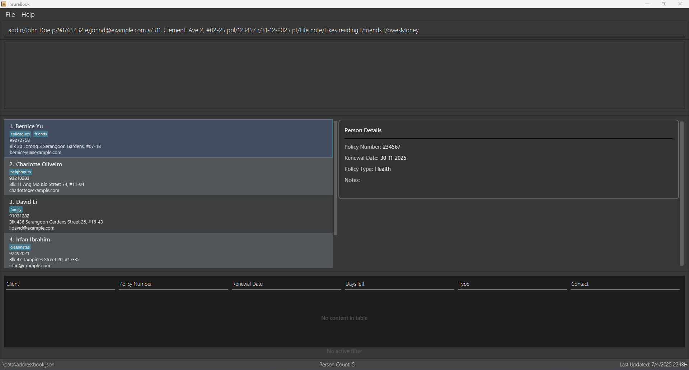

* After running the command:
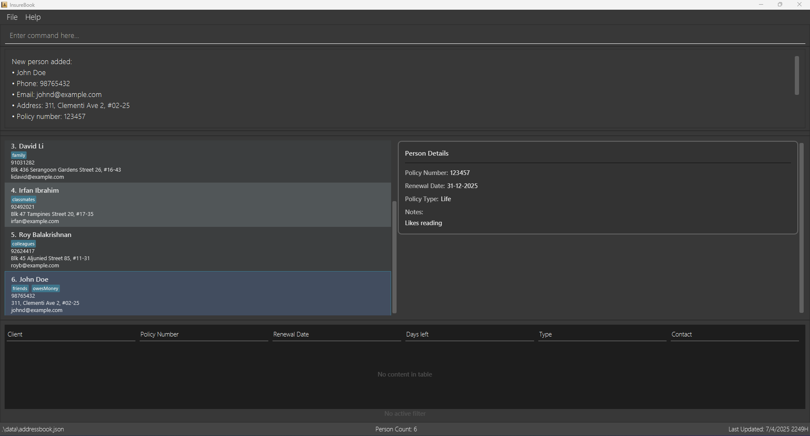

<box type="warning" seamless>

**Warning: Duplicate Policy Numbers**

Each policy number must be unique in the system. If you attempt to add a person with a policy number that already exists:
* An error message will be shown
* The person will not be added
* You should verify the correct policy number and try again
</box>

<box type="tip" seamless>

**Tip:** Names such as X Æ A-Xii Musk is not valid unfortunately.
</box>

#### Editing a person : `edit`

Format: `edit` INDEX [n/NAME] [p/PHONE] [e/EMAIL] [a/ADDRESS] [pol/POLICY_NUMBER] [pt/POLICY_TYPE] [r/RENEWAL_DATE] [note/NOTE] [t/TAG]…​

*   Edits the person at the specified `INDEX`. The index refers to the index number shown in the displayed person list. The index **must be a positive integer** 1, 2, 3, …​
*   At least one of the optional fields must be provided.
*   Existing values will be updated to the input values.
*   When editing tags, the existing tags of the person will be removed i.e adding of tags is not cumulative.
*   You can remove all the person's tags by typing `t/` without
    specifying any tags after it.

<box type="warning" seamless>

**Warning: Duplicate Entries**

A person is considered a duplicate if the edit would result in:
* The same policy number as another person, OR
* The same name and email as another person, OR
* The same name and phone number as another person

If your edit would create any of these duplicate conditions:
* An error message will be shown indicating which condition was matched
* The edit will not be applied
* You should modify your edit to ensure the result is unique
</box>

Examples:

* `edit` 1 p/91234567 e/johndoe@example.com pt/Health r/31-12-2024
* `edit` 2 n/Betsy Crower t/

Expected Output:
* Before running the command:
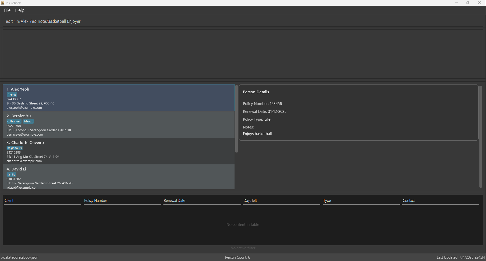

* After running the command:

#### Deleting a person : `delete`

Format: `delete` INDEX

*   Deletes the person at the specified `INDEX`.
*   The index refers to the index number shown in the displayed person list.
*   The index **must be a positive integer** 1, 2, 3, …​

<box type="danger" seamless>

**Warning: Irreversible Action ⛔**

* The delete command permanently removes the client's data
* This action cannot be undone
* Make sure you have selected the correct index before deleting
</box>

Examples:

* `delete` 2
* `find` Betsy followed by `delete` 1

Expected Output:
* Before running the command:
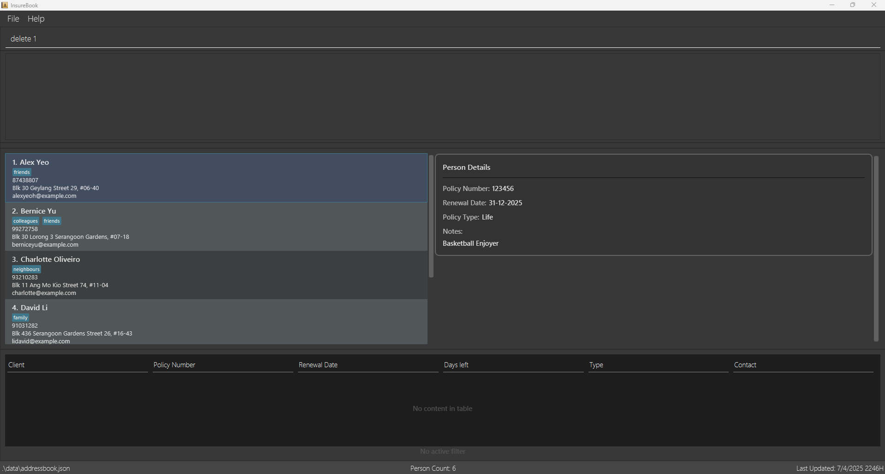

* After running the command:
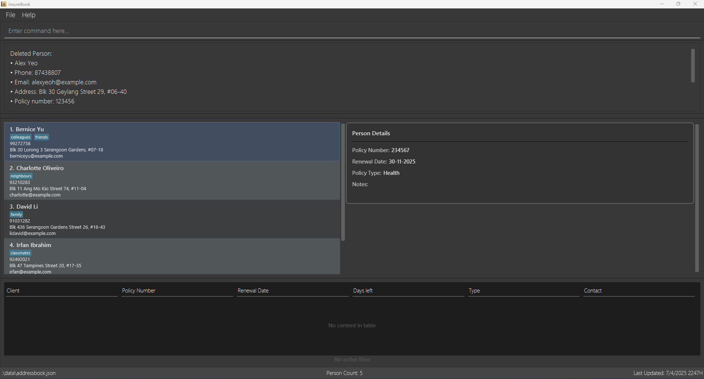

### Policy Management Commands

#### Updating a policy renewal date : `renew`

Format: `renew` pol/POLICY_NUMBER r/RENEWAL_DATE

<box type="warning" seamless>

**Warning: Single Policy Renewal ⚠️**

* Only one policy can be renewed at a time
* To renew multiple policies, use the command separately for each policy
</box>

*   The `pol/POLICY_NUMBER` parameter must be a valid policy number in the system.
*   The `r/RENEWAL_DATE` parameter must be in the format `DD-MM-YYYY`.

Examples:

* `renew` pol/123456 r/01-01-2026
 

Expected Output:
* Before running the renew command:
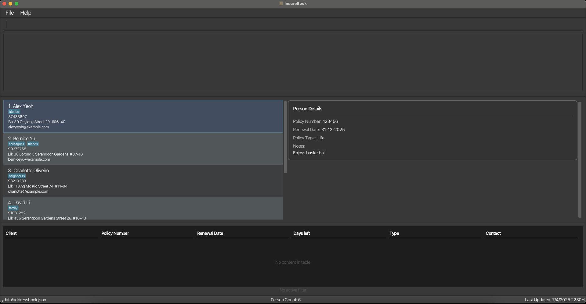

* After running `renew pol/123456 r/01-01-2026`:
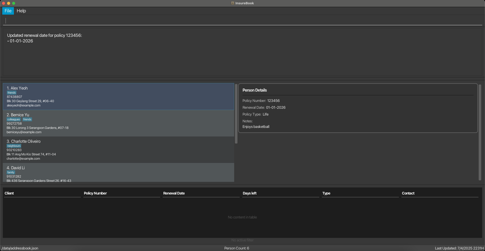

#### Viewing upcoming policy renewals : `viewrenewals`

Format: `viewrenewals` [n/NEXT_N_DAYS] [s/SORT_ORDER]

<box type="warning" seamless>

**Warning: Integer Days Only ⚠️**

* The NEXT_N_DAYS parameter must be a positive integer
* Decimal numbers or negative values are not accepted
* Example: Use `n/30` for next 30 days, not `n/30.5` or `n/-30`
</box>

Examples:

* `viewrenewals`
* `viewrenewals` n/60
* `viewrenewals` n/60 s/name

Expected Output:
* Before running the viewrenewals command:
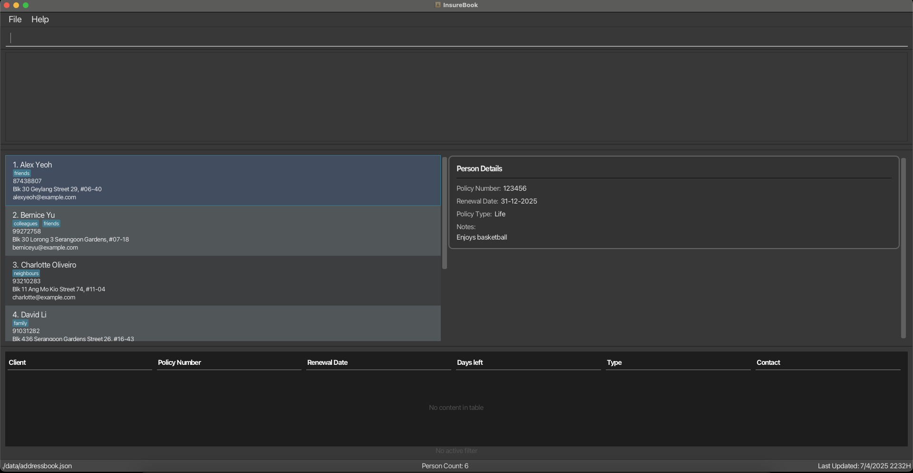

* After running `viewrenewals n/200 s/name`:
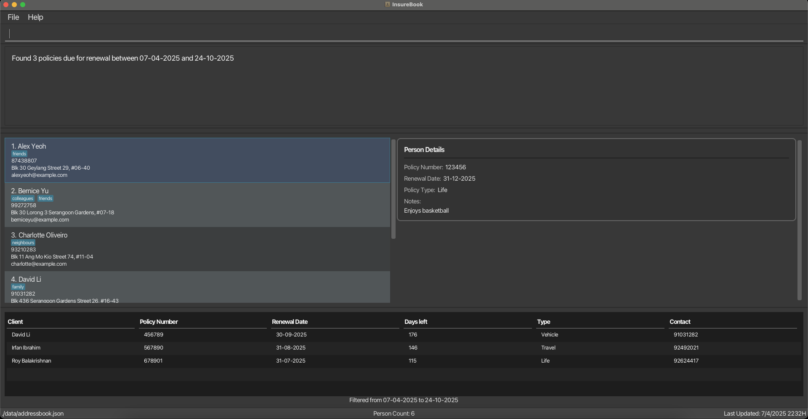

#### View policy renewals in date range : `filter`

Format: `filter` sd/START_DATE ed/END_DATE [s/SORT_ORDER]

<box type="warning" seamless>

**Warning: Valid Date Range ⚠️**

* The END_DATE must be later than or equal to the START_DATE
* Both dates must be in DD-MM-YYYY format
* Example: `sd/01-01-2024 ed/31-12-2024` is valid
* Example: `sd/31-12-2024 ed/01-01-2024` is invalid (end date before start date)
</box>

*   The `sd/START_DATE` parameter must be in the format `DD-MM-YYYY`.
*   The `ed/END_DATE` parameter must be in the format `DD-MM-YYYY`.
*   The search results will include policy renewals between the specified start date and end date.

Examples:

* `filter` sd/01-03-2025 ed/31-03-2025
* `filter` sd/01-01-2025 ed/30-06-2025 s/name

Expected Output:
* Before running the filter command:
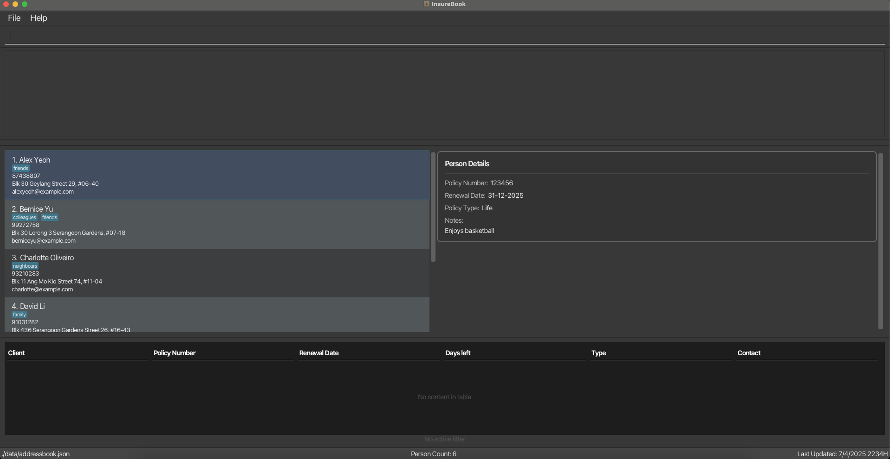

* After running `filter sd/01-06-2025 ed/01-01-2026`:
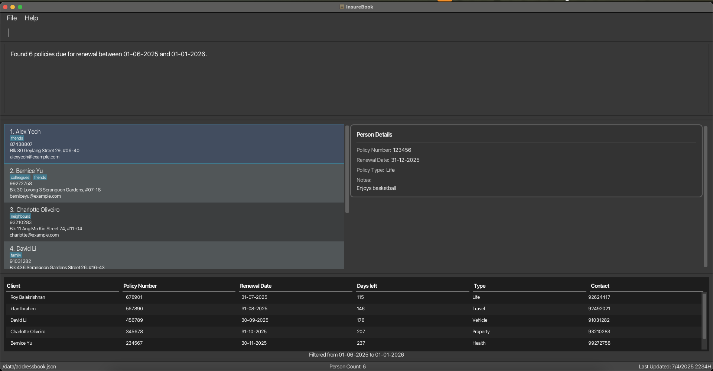

### Search Commands

#### Listing all persons : `list`

Shows a list of all persons in the address book.

Format: `list`

Each person card in the list displays:

*   Name
*   Phone number
*   Email address
*   Physical address
*   Policy number
*   Policy type (Life, Health, Property, Vehicle, or Travel)
*   Renewal date (displayed as "Renewal date: DD-MM-YYYY")
*   Tags (if any)

The policy type and renewal date are clearly labeled to help insurance agents quickly identify the types of policies and when they need to be renewed.

#### Locating persons by keyword : `find`

Searches given person fields by specific keyword and returns any matching entries
Format: `find` [n/NAME]…​ [p/PHONE]…​ [e/EMAIL]…​ [a/ADDRESS]…​ [pol/POLICY_NUMBER]…​ [pt/POLICY_TYPE]…​ [t/TAG]…​ [s/SORT_ORDER]…​

*   At least one of the optional fields must be provided.
*   Each field may be provided more than once except `SORT_ORDER`.
*   `NAME` and `ADDRESS` field may contain more than one word.
*   The search is case-insensitive. e.g `hans` will match `Hans`
*   The order of the values matter for a field but not for different fields. e.g. `n/Hans Bo` will not match `Bo Hans` but `n/Hans n/Bo` will match `Bo Hans`
*   Partial words will also be matched e.g. `n/Han` will match `Hans`
*   Partial search for emails must be concatenated with `@` followed by at least 2 characters e.g. `e/ice@ex` will match `alice@example.com` but `alice@e` will not match `alice@example.com`
*   Persons matching at least one field will be returned (i.e. `OR` search).
    e.g. `n/Hans n/Bo` will return `Hans Gruber`, `Bo Yang`
*   Tags are supported. You can add one or more tags using `t/TAG`. The search for tags is not case-sensitive and must be an exact word.
*   Policy types are supported. You can search for specific policy types using `pt/POLICY_TYPE`. Valid policy types are: Life, Health, Property, Vehicle, and Travel. The search is not case-sensitive.
*   The search results can be sorted using `s/SORT_ORDER` by `name` or by `tag` only. The default sort order is by name. Tag sorting sorts by entries with the most number of tags first.

<box type="info" seamless>

**Note:** The sorting order is case-sensitive and follows ASCII values. This means lowercase letters are ordered after uppercase ones. For example, `Bernice` will appear after `alice`.
</box>

Examples:

* `find` n/olive
* `find` n/Amy p/999
* `find` n/alex n/david
* `find` t/friends t/colleagues s/tag

Expected Output (Partial name searching example):
* Before running the find command:
  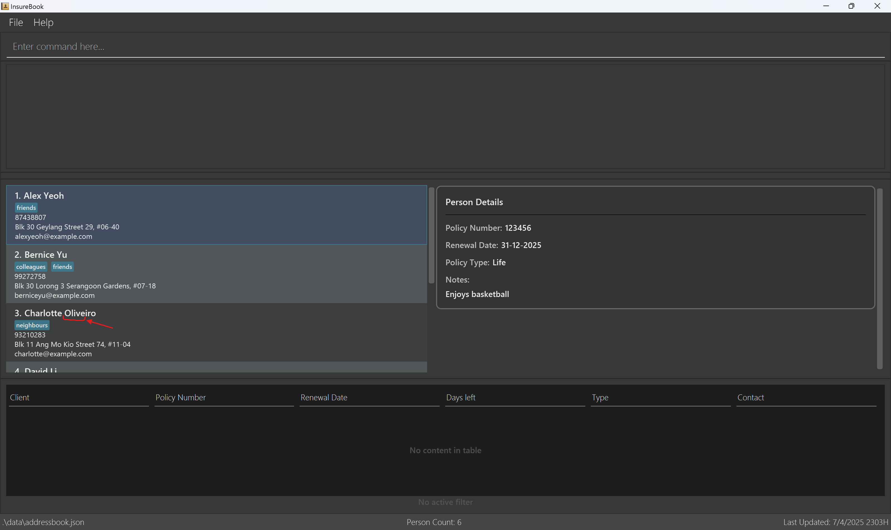

* After running `find n/olive`:
  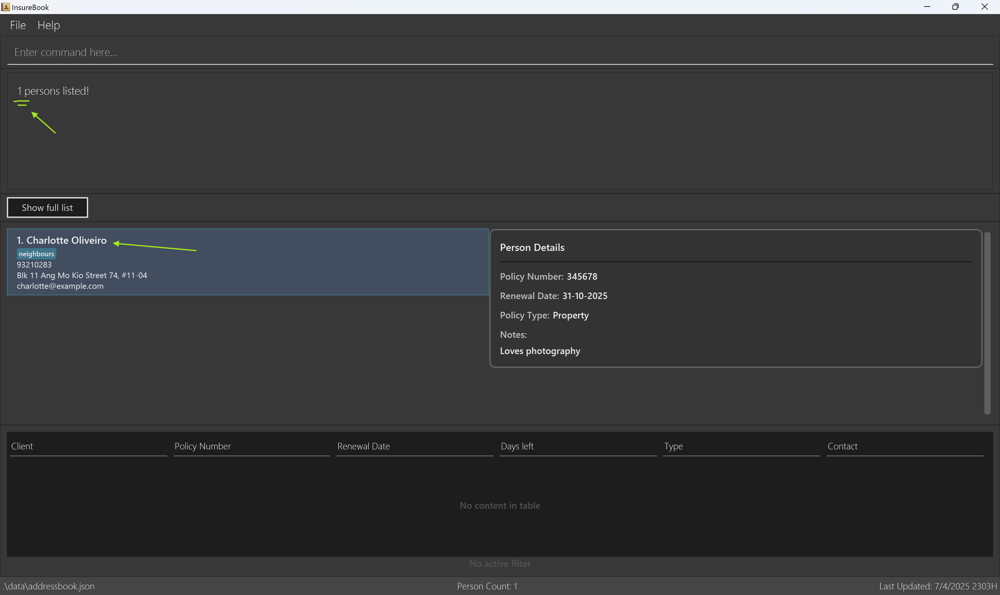

Expected Output (Tag searching example):
* Before running the find command:
  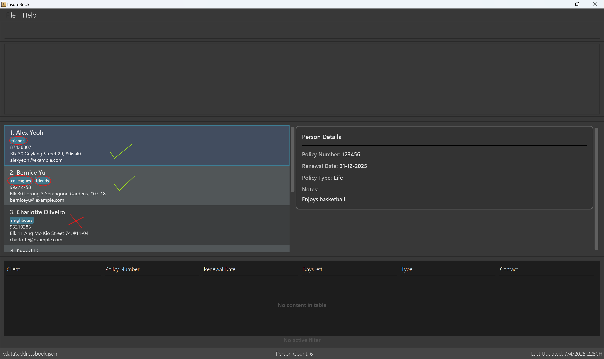

* After running `find t/friends t/colleagues s/tag`:
  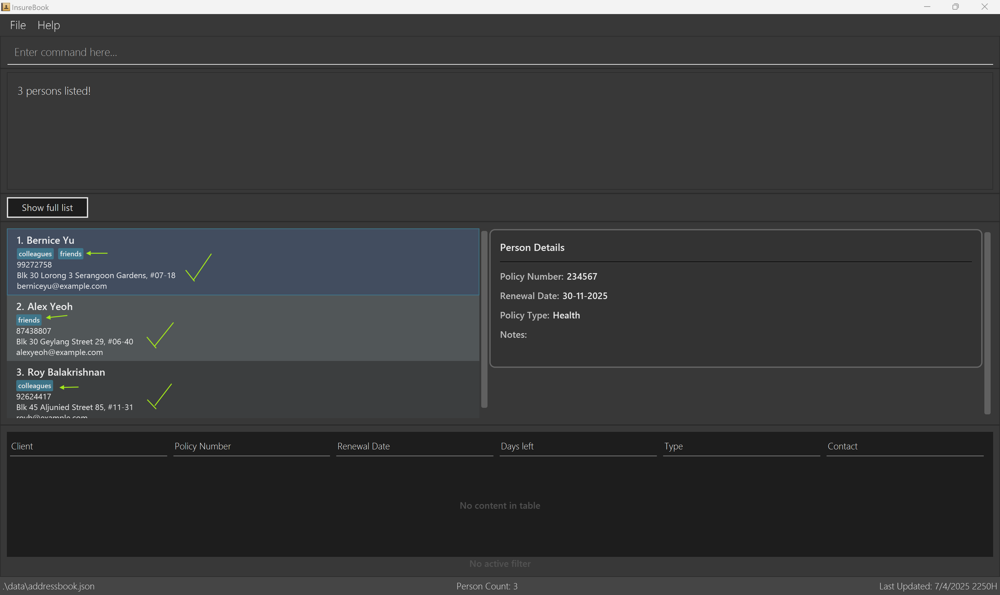

### General Commands

#### Viewing help : `help`

Shows a message explaining how to access the help page.

Format: `help`

Expected output after running `help` : 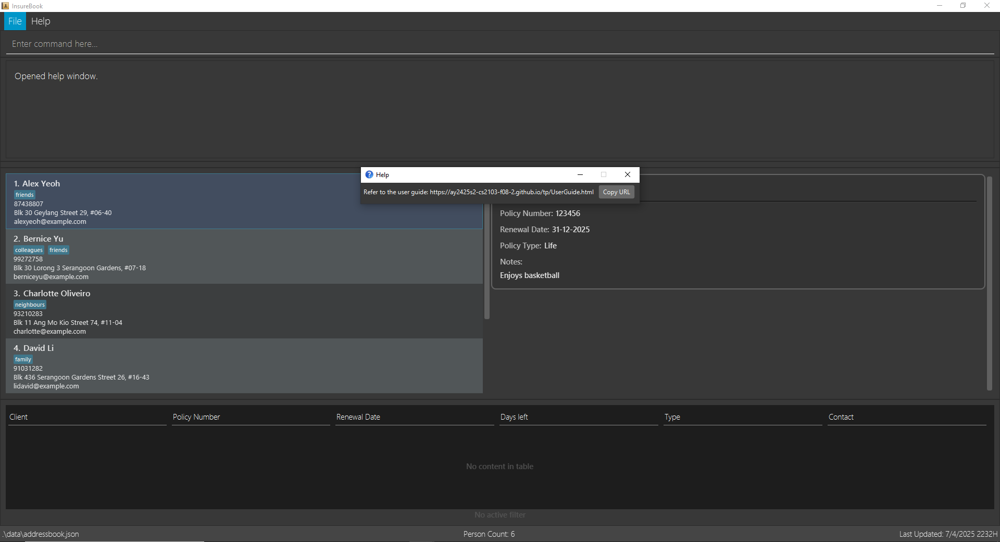

#### Clearing all entries : `clear`

Format: `clear`

<box type="danger" seamless>

**Warning: Irreversible Action ⛔**

* The clear command permanently removes ALL client data
* This action CANNOT be undone
* Double-check that you really want to delete everything
</box>

Expected output after running `clear`: 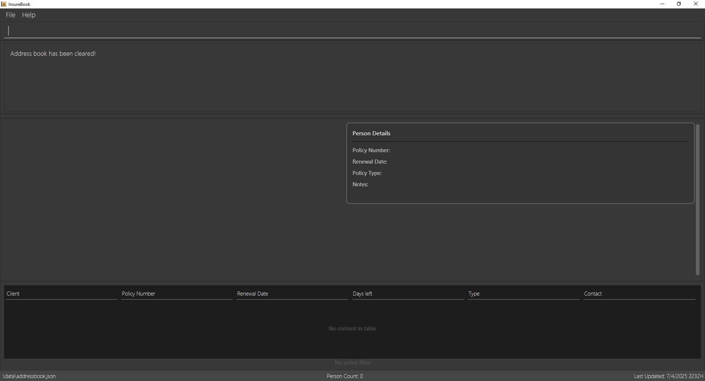

#### Exiting the program : `exit`

Format: `exit`

Expected output after running `exit`: InsureBook **closes**.

### FAQ

**Q:** How do I add a new person to the address book?

**A:** Use the `add` command. For example, `add` n/John Doe p/98765432 e/johnd@example.com a/John street, block 123, #01-01 pol/123456 pt/Life r/31-12-2024 note/Basketball Player.

**Q:** How do I edit a person's information?

**A:** Use the `edit` command. For example, `edit` 1 p/91234567 e/johndoe@example.com pt/Health r/31-12-2024.

**Q:** How do I delete a person from the address book?

**A:** Use the `delete` command. For example, `delete` 1.

**Q:** How do I clear all entries from the address book?

**A:** Use the `clear` command. For example, `clear`.

**Q:** How do I exit the program?

**A:** Use the `exit` command. For example, `exit`.

**Q:** How do I update a policy renewal date?

**A:** Use the `renew` command. For example, `renew` pol/123456 r/31-12-2025.

**Q:** How do I view upcoming policy renewals?

**A:** Use the `viewrenewals` command. For example, `viewrenewals` n/60.

**Q:** How do I filter policy renewals in a date range?

**A:** Use the `filter` command. For example, `filter` sd/01-03-2025 ed/31-03-2025.

**Q:** How do I save the data?

**A:** Use the `save` command. For example, `save` addressbook.json.

**Q:** How do I edit the data file?

**A:** Use the `edit` command. For example, `edit` addressbook.json.

### Known Issues

**I:** I'm unable to add a new person to the address book.

**A:** Ensure that all fields are filled out correctly and that the phone number, email, and policy number are in the correct format.

**I:** I'm unable to edit a person's information.

**A:** Ensure that the index is correct and that all fields are filled out correctly.

**I:** I'm unable to delete a person from the address book.

**A:** Ensure that the index is correct and that the person exists in the address book.

**I:** I'm unable to clear all entries from the address book.

**A:** Ensure that you have the correct permissions to clear the address book.

**I:** I'm unable to exit the program.

**A:** Ensure that you have saved all changes before exiting the program.

**I:** I'm unable to update a policy renewal date.

**A:** Ensure that the policy number is correct and that the renewal date is in the correct format.

**I:** I'm unable to view upcoming policy renewals.

**A:** Ensure that the program is up to date and that there are no issues with the data file.

**I:** I'm unable to filter policy renewals in a date range.

**A:** Ensure that the start and end dates are in the correct format and that the data file is up to date.

**I:** I'm unable to save the data.

**A:** Ensure that the file name is correct and that you have the correct permissions to save the file.

**I:** I'm unable to edit the data file.

**A:** Ensure that the file name is correct and that you have the correct permissions to edit the file.

### Command Summary

### Client Management Commands
| Command | Format |
|---------|---------|
| `add` | `add` n/NAME p/PHONE_NUMBER e/EMAIL a/ADDRESS pol/POLICY_NUMBER [pt/POLICY_TYPE] [r/RENEWAL_DATE] [note/NOTE] [t/TAG]…​ |
| `edit` | `edit` INDEX [n/NAME] [p/PHONE] [e/EMAIL] [a/ADDRESS] [pol/POLICY_NUMBER] [pt/POLICY_TYPE] [r/RENEWAL_DATE] [note/NOTE] [t/TAG]…​ |
| `delete` | `delete` INDEX |

### Policy Management Commands
| Command | Format |
|---------|---------|
| `renew` | `renew` pol/POLICY_NUMBER r/RENEWAL_DATE |
| `viewrenewals` | `viewrenewals` [n/NEXT_N_DAYS] [s/SORT_ORDER] |
| `filter` | `filter` sd/START_DATE ed/END_DATE [s/SORT_ORDER] |

### Search Commands
| Command | Format |
|---------|---------|
| `list` | `list` |
| `find` | `find` [n/NAME]…​ [p/PHONE]…​ [e/EMAIL]…​ [a/ADDRESS]…​ [pol/POLICY_NUMBER]…​ [pt/POLICY_TYPE]…​ [t/TAG]…​ [s/SORT_ORDER]…​ |

### General Commands
| Command | Format |
|---------|---------|
| `help` | `help` |
| `clear` | `clear` |
| `exit` | `exit` |

---

## Glossary

| Term | Meaning |
|---------|---------|
| `Agent` | Refers to the insurance agent who uses InsureBook to manage and organize client information. |
| `Client` | Refers to an individual’s entry in InsureBook, containing contact information (name, phone, email, address) and at least one insurance policy. |
| `InsureBook` | A desktop application (with both a CLI and GUI) that helps insurance agents manage and organize client information. |
| `CLI (Command Line Interface)` | A text-based interface where users type commands to interact with the application. |
| `GUI (Graphical User Interface)` | A visual interface that displays buttons, text fields, and other elements, providing a more familiar point-and-click experience. |
| `Policy` | An insurance policy associated with the client. The policy number is a unique numeric identifier (e.g., “123456”). |
| `Policy Type` | Category of an insurance policy. Valid options include Life, Health, Property, Vehicle, or Travel. |
| `Renewal Date` | The date (DD‑MM‑YYYY) on which the policy is due to be renewed. Used by commands like <code>renew</code>, <code>viewrenewals</code>, and <code>filter</code>. |
| `Tag` | A label that can be attached to a client for categorization or quick reference (e.g., “friend,” “colleague,” “VIP”). |
| `Command Word` | The keyword used to invoke a specific operation in InsureBook (e.g., <code>add</code>, <code>edit</code>, <code>delete</code>, <code>find</code>). |
| `Parameter` | Additional information following a command word, usually prefixed with a letter and slash (e.g., <code>n/NAME</code>, <code>p/PHONE_NUMBER</code>). |
| `Index` | The number shown beside a client’s entry in the displayed list. Used to identify which client to edit or delete. |
| `Duplicate Entries` | If you try to add or edit a client so that it shares a policy number or certain combination of name/phone/email with an existing client, InsureBook treats it as a duplicate and blocks the action. |
| `Lexicographical Order` | Sorting based on alphabetical character order, comparing strings from left to right. |
| `Sort Order` | Some commands (like <code>viewrenewals</code> and <code>find</code>) let you sort results by <code>name</code> or <code>tag</code>. |
| `Data File` | The file (often named <code>addressbook.json</code>) where InsureBook stores all client data. Used by commands like <code>save</code> and <code>edit</code>. |

---
